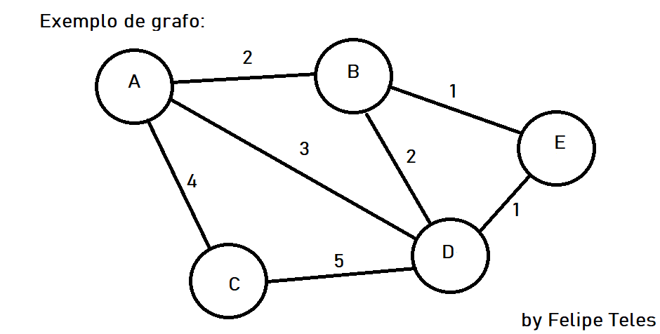

# Grafos

Grafos são o conjunto de Arestas e Vertices. Exemplificando um pouco a aplicação vale ressaltar a nomenclatura, isto é, dado um Grafo G(V, E) tal sentença pode ser lido como um grafo que possui uma quantidade de V de vertices e E de arestas

## Definição

### Vertice

Vertice ou nó pode ser visto como as bolinhas de um grafo digamos assim , que em termos tecnicos representam as extremidades. Um vertice geralmente possui uma identificação podendo ser tanto um indice de um vetor como um identificador unico, além de talvez possuir um peso ou em algums aplicações uma cor.

### Arestas

Arestas ou linhas são a junção entre os vertices de um grafo. Geralmente possuem um valor que auxilia na solução de problemas de diversos tipos e aplicações

### Exemplo

#### Vertices

No exemplo acima temos a quantidade de 5 vértices, sendo eles: **A**, **B**, **C**, **D**, **E**

#### Arestas

No exemplo acima temos a quantidade de 7 arestas e cada uma dela possui um valor que chamamos de peso. A descrição das arestas são:

- **AB** -> peso: 2
- **AC** -> peso: 4
- **AD** -> peso: 3
- **BE** -> peso: 1
- **BD** -> peso: 2
- **ED** -> peso: 1
- **DC** -> peso: 5

## Aplicações

### Teseu e o minotauro

todo: kruskal
